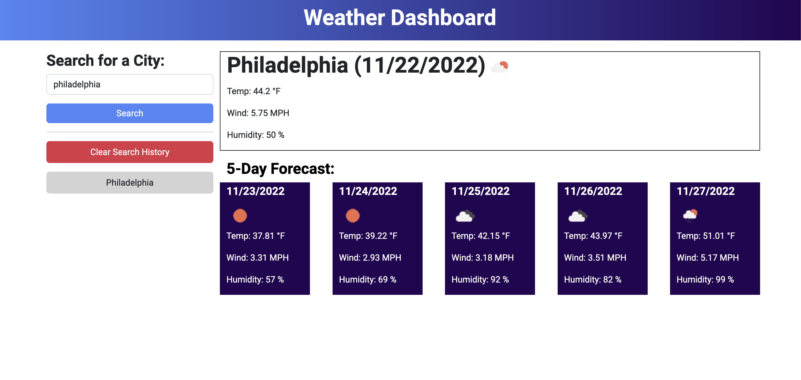

# Weather Dashboard

## Description

https://antced.github.io/weather-dashboard/

Current and 5-day weather dashboard that uses OpenWeatherMap APIs for weather data. Includes the following features:

- Bootstrap
- jQuery
- Local Storage
- Clearable History

## Credits

Worked on as a project for UPENN's coding bootcamp under the instruction of Leif Hetland. Uses OpenWeatherMap API. With help from Leon and Justin.
